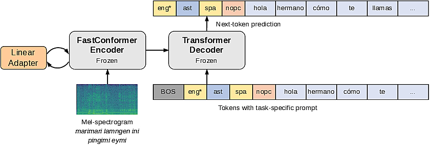
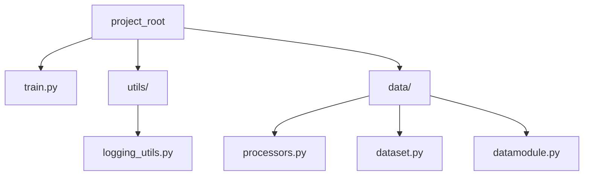

# IWSLT Experiments - Low Resource Track

This repository contains the experiments developed for participation in the [IWSLT 2026 shared task](https://iwslt.org/2026/low-resource), specifically in the low resource track. The main objective is to implement automatic speech translation (AST) systems for **Mapudungun (arn)** $\rightarrow$ **Spanish (spa)**.

The [NVIDIA canary-1B-v2](https://huggingface.co/nvidia/canary-1b-v2) model is used as a base, applying PEFT techniques through adapters to optimize performance for these languages with limited available data.

## Architecture



## Scripts



### 1. Data Processing

- `process_manifets.py`: Cleans JSON manifest files (converts to lowercase, removes punctuation) and allows filtering audio files that exceed a maximum duration (15 seconds by default).
- `data_exploration.py`: Notebook/Script for exploring Mapudungun datasets (via HuggingFace).

### 2. Training

- `Multi_Task_Adapters.py`: Adapters tutorial provided by NVIDIA.
- `canary_experiments.py`: Prototyping notebook that serves as the basis for the main training script.
- `canary_script.py`: The main training script. It implements the training logic, data structure (`CanaryMultilingualDataModule`), and model configuration to adapt Canary to the target languages.

### 3. Audio Augmentation

- `custom_aumentation.py`: Defines a data augmentation pipeline using `audiomentations` to improve model robustness by adding Gaussian noise, pitch shifting, band-pass filters, and impulse responses (reverberation).

### 4. Evaluation and Inference

- `canary_eval.py`: Prototype notebook that served as the basis for the evaluation script. 
- `canary_eval_script.py`: Model performance evaluation script using standard metrics such as **WER** (Word Error Rate) and **SacreBLEU**.
- `canary_transcript.py`: Script to generate the final text transcriptions required for competition submission.

## Usage

### Training

To train adapters for a specific language (e.g., Mapudungun):

```bash
python canary_script.py --language-mode map --batch-size 8 --max-epochs 50 --output-dir ./models
```

For multilingual training (Mapudungun and Quechua):

```bash
python canary_script.py --language-mode multi --batch-size 4 --max-epochs 100
```

### Manifest Preprocessing

To clean a manifest file and filter long audios:

```bash
python process_manifets.py path/to/manifest.json --filter-long
```

### Model Evaluation

To evaluate a model with a specific adapter:

```bash
python canary_eval_script.py --manifest path/test_manifest.json --adapter-path models/adapter_name.pt
```

### Submission Transcription Generation

To generate the text file with predictions:

```bash
python canary_transcript.py --manifest path/test_manifest.json --adapter-path models/adapter_name.pt --label primary
```

---
**Base Model:** `nvidia/canary-1b-v2` (NVIDIA NeMo)

## Related notebook tutorial

- [Multi task Adapters tutorial](https://github.com/NVIDIA-NeMo/Speech/blob/main/tutorials/asr/asr_adapters/Multi_Task_Adapters.ipynb)

### Nemo intallation

```sh
!python -m pip install "nemo_toolkit[asr] @ git+https://github.com/NVIDIA-NeMo/Speech.git@main"
```
